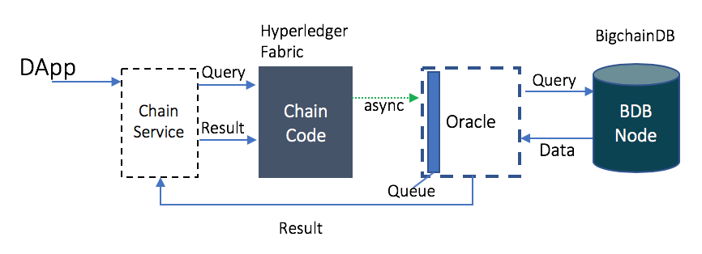

# BigchainDB-Hyperledger Fabric Integration

This project is the outcome of a mini-hackathon in which the BigchainDB and TheLedger teams participated on the 16-17 of August 2018.

## Design

 

**The high level design specification is available at - [./specs/design.md](./specs/design.md)**

## Directory Structure

The directory structure of this project is as below :

```
.
├── LICENSE
├── README.md
├── bdb-hyperledger-oracle/
│  
├── data_job/
│   
├── hyperledger-chainservice/
│  
├── specs/
│   
└── ui/
```

### data_job/

This is a node based cron job that posts transactions to BigchainDB network. 

### ui/

This is a react based app to access REST API of Hyperledger Fabric chain service. This UI is for demo usage of the BigchainDB-Hyperledger Fabric oracle. The web form first creates a BigchainDB asset by taking passphrase and asset data (a number). Once the asset is created, the asset id is passed to a Hyperledger chain-code which internally passes it to the oracle. The oracle then queries BigchainDB with the asset id and executes a callback passed by the Hyperledger chain-code. The oracle then sends back the results to Hyperledger chain service.

### hyperledger-chainservice/

This is hyperledger chain-service that interacts with the fabric network.

### bdb-hyperledger-oracle/

This project is an express API that functions as an oracle between Hyperledger Fabric (here in `hyperledger-chainservice/`) and BigchainDB.

In a real scenario, the chain-code can do pre-processing and create a dynamic callback before sending the request to the oracle.

## Installation & Usage

### Prerequisites

* BigchainDB network is up and running
* Hyperledger network is up and running (to run the Hyperledger fabric network, run the `startFabric.sh` script in the `/hyperledger-network/scripts` directory)

### Installation

* Create `.env` files in the root of each of oracle, chainservice and ui based on their `.env.example` files, respectively.

* Update the `.env` values as per your network and node IP addresses and ports.

* From new terminal, in `hyperledger-chainservice/` execute `yarn` and `yarn run start:watch`. This will start Hyperledger-chaincode REST server to be consumed by UI.

* From new terminal, in `ui/`, execute `npm install` and then `npm start`. This will start react application on port 3000.

* From another new terminal, run `docker-compose build` and `docker-compose up` from the root directory. This will bring up the oracle.

### Usage

* In your browser, visit `http://localhost:3000`, you will see UI for this project.
* Follow the instructions on the web page.